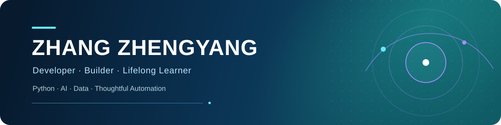

  

  

## Hello / 你好 👋

I'm **Zhang Zhengyang**, a developer who enjoys turning real-world problems into focused, useful software.

我喜欢把日常需求做成真正可用的产品。目前主要关注 **AI 应用、自动化工具、数据分析**，以及兼顾隐私与体验的本地优先软件。

- 🧠 Exploring practical AI and reproducible machine-learning workflows
- 🛠️ Building tools for personal productivity, finance, and research
- 🌱 Learning by shipping, documenting, and iterating in public
- 🧭 I value simple interfaces, traceable data, and maintainable code

## Tech I work with

  
  
  
  
  
  
  
  

## Featured projects

<table>
  <tr>
    <td width="50%" valign="top">
      <h3><a href="https://github.com/yangzhang0215/talk2ledger">Talk2Ledger</a></h3>
      
A local-first conversational finance tracker that turns natural-language input into structured transactions.

      
<code>Python</code> <code>FastAPI</code> <code>React</code> <code>SQLite</code>

    </td>
    <td width="50%" valign="top">
      <h3><a href="https://github.com/yangzhang0215/ml-cuzrcr">ml-cuzrcr</a></h3>
      
A reproducible machine-learning workflow for studying process–property relationships in copper alloys.

      
<code>Python</code> <code>Machine Learning</code> <code>SHAP</code>

    </td>
  </tr>
  <tr>
    <td width="50%" valign="top">
      <h3><a href="https://github.com/yangzhang0215/device-trade-ledger">device-trade-ledger</a></h3>
      
A desktop ledger for device trading, profit tracking, dividend management, and report export.

      
<code>Python</code> <code>PySide6</code> <code>SQLite</code>

    </td>
    <td width="50%" valign="top">
      <h3><a href="https://github.com/yangzhang0215/XAUAT-autolib">XAUAT-autolib</a></h3>
      
A maintained library-room reservation utility with a portable GUI and macOS command-line workflow.

      
<code>Python</code> <code>Automation</code> <code>Desktop GUI</code>

    </td>
  </tr>
</table>

## GitHub at a glance

  <picture>
    <source media="(prefers-color-scheme: dark)" srcset="https://github-profile-summary-cards.vercel.app/api/cards/profile-details?username=yangzhang0215&amp;theme=github_dark" />
    <source media="(prefers-color-scheme: light)" srcset="https://github-profile-summary-cards.vercel.app/api/cards/profile-details?username=yangzhang0215&amp;theme=github" />
    
  </picture>

  Build small. Learn fast. Keep it useful.

